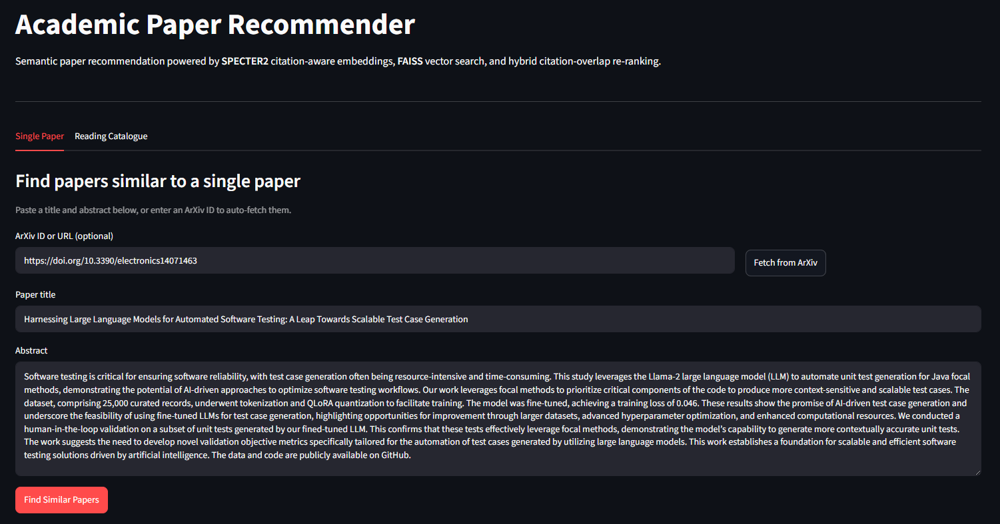
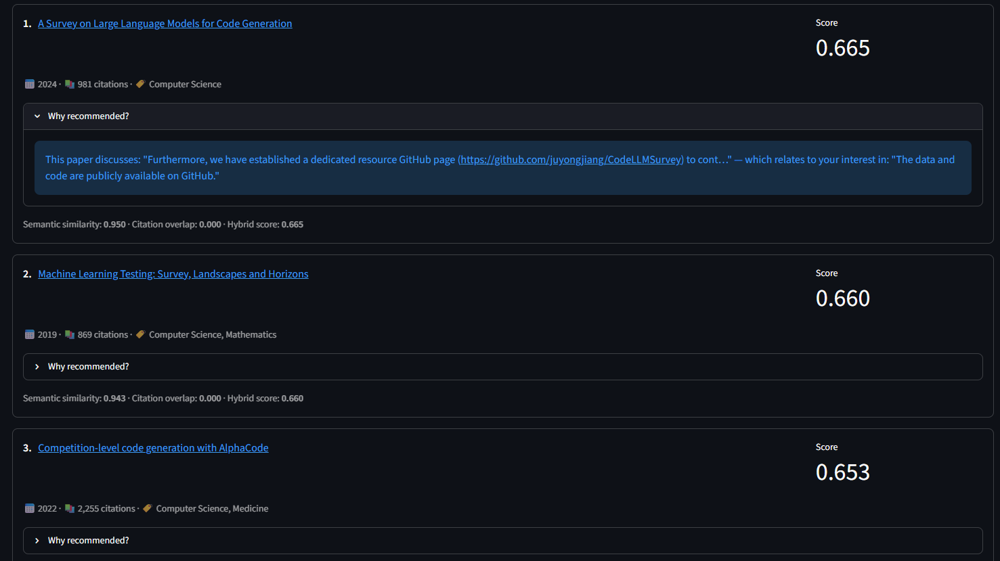

# Citation Recommender

A tool that takes a research paper and recommends other papers you'd probably find useful. You can either paste in a single abstract, or give it a list of papers you've already read and it'll suggest what to read next.

I built this as a portfolio project while learning about recommender systems. The interesting angle here is that instead of just matching papers by shared keywords, it uses a model that was trained specifically on academic citation relationships, so it has some sense of which papers the research community actually treats as related, not just which ones happen to use similar words.

---

## Screenshots





---

## How it works

There are three main parts to the system:

**Embeddings (SPECTER2)**

The foundation is [SPECTER2](https://huggingface.co/allenai/specter2_base), a model from Allen AI. It reads a paper's title and abstract and converts it into a list of 768 numbers: coordinates that place the paper somewhere in a 768-dimensional mathematical space. The useful property is that papers researchers tend to cite together end up close to each other in that space, because SPECTER2 was trained on millions of citation links from Semantic Scholar. So "BERT" and "GPT" end up near each other not because they share words, but because the research community treats them as related.

I ran all 5,769 papers in the corpus through it and saved the resulting vectors.

**Vector search (FAISS)**

Once you have numeric representations for every paper, you need a fast way to find which ones are closest to a given query. FAISS (from Meta AI) handles this by storing all the vectors and can find the nearest neighbours in milliseconds, even across thousands of papers. When someone submits a query, their paper gets converted into the same format and FAISS returns the 50 most similar papers almost instantly.

**Re-ranking**

The top 50 from FAISS get re-scored before the final results are shown. The reason for this step is that two papers can look similar at the embedding level but actually belong to quite different research sub-communities. Citation overlap adds a structural signal on top of the semantic one: if the query paper and a candidate cite many of the same prior work, they're probably in the same academic conversation. The final score combines both:

```
score = 0.7 × semantic_similarity + 0.3 × citation_overlap
```

The 0.7/0.3 split is adjustable in the app's sidebar. Each recommendation also comes with a short explanation which is the specific sentence from the candidate's abstract that most closely matches the query.

---

## Evaluation

To check whether the citation-aware approach actually helps, I compared it against a straightforward TF-IDF baseline (bag-of-words cosine similarity) on 500 test papers. For each test paper, the system is asked to retrieve its actual cited papers from the corpus: the idea being that if a paper cited something, that's a reasonable proxy for "this was relevant to them."

| Metric | SPECTER2 | TF-IDF baseline | Improvement |
|--------|----------|----------------|-------------|
| Precision@10 | 0.146 | 0.120 | +21.5% |
| Recall@10 | 0.136 | 0.116 | +17.5% |
| NDCG@10 | 0.186 | 0.159 | +17.1% |
| MRR | 0.384 | 0.344 | +11.7% |

SPECTER2 outperforms TF-IDF across all four metrics. The most readable number is MRR (0.38): it means the first actually relevant result tends to appear around rank 2–3 on average, which is reasonably useful in practice.

The absolute numbers are modest because the corpus is small (5,769 papers from Semantic Scholar). Most papers' real citations simply aren't in the index, which caps how well any system can score on this evaluation. A larger corpus would push these numbers up significantly.

---

## Running it yourself

**Requirements:** Python 3.12+, around 5 GB of free disk space (model weights + corpus data).

```bash
git clone https://github.com/Shaheer-Rehan/Citation_Recommender
cd Citation_Recommender

# Set up the virtual environment
python -m venv venv

# Activate it
.\venv\Scripts\Activate.ps1        # Windows PowerShell
# source venv/bin/activate          # Mac / Linux

# Install torch CPU-only first (avoids downloading a 2GB CUDA build)
pip install torch --index-url https://download.pytorch.org/whl/cpu

# Install everything else
pip install -r requirements.txt
```

**Build the paper corpus:** You will need a free API key from [Semantic Scholar](https://www.semanticscholar.org/product/api)

```bash
# Set your key (Windows PowerShell)
$env:S2_API_KEY = "your-key-here"

# Fetch ~5,000-10,000 ML/NLP papers from Semantic Scholar (~5 min)
python data/fetch_papers.py

# Run SPECTER2 over all papers to generate embeddings (~90 min on CPU)
python embeddings/embed_papers.py

# Build the FAISS index from the embeddings (~30 seconds)
python index/build_index.py
```

**Launch the app:**

```bash
python -m streamlit run app.py
```

Open `http://localhost:8501` in your browser. The first load takes about 30 seconds while the model and index load into memory. After that, queries are instant.

**Run the evaluation:**

```bash
python evaluation/evaluate.py
```

**Run the tests (240 unit tests):**

```bash
python -m pytest tests/
```

---

## Tech stack

- **SPECTER2**: citation-aware paper embeddings (Allen AI / HuggingFace)
- **FAISS**: vector similarity search (Meta AI)
- **Semantic Scholar API**: paper corpus
- **Streamlit**: demo interface
- **sentence-transformers**: lightweight sentence embeddings for the explanation layer
- **scikit-learn**: TF-IDF baseline
- **PyTorch** (CPU): model inference
- **pandas / pyarrow**: data handling

---

## What I'd improve with more time

The corpus size is the biggest limitation. Semantic Scholar's search endpoint caps at 1,000 results per query, so the current index covers about 5,700 papers. Their bulk dataset API would allow building an index over millions of papers, which would make the tool genuinely useful rather than just demonstrative.

Beyond that: logging which results users actually click would let you tune the re-ranking formula properly instead of picking the 0.7/0.3 split by hand, and adding a recency weighting option would help in fields where older papers are less relevant.
